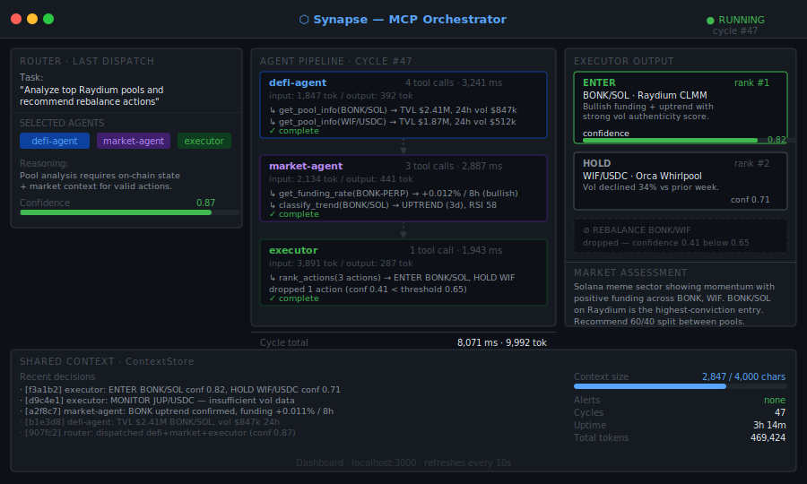

# Synapse


A multi-agent MCP orchestrator for Solana DeFi. Send a task — Synapse routes it to the right combination of specialized Claude agents, runs them in sequence, and returns a synthesized action plan.

<br/>



<br/>

---

## How it works

Most DeFi analysis requires at least two distinct skill sets: reading raw on-chain state (pool TVL, bin arrays, prices) and interpreting what that state means in market context (trend, funding sentiment, cross-exchange divergence). These are different jobs that benefit from different prompts, different tools, and different reasoning styles.

Synapse splits them:

- **defi-agent** — on-chain data specialist. Fetches pool states, scores volume authenticity, pulls token prices. Reports raw numbers.
- **market-agent** — market analyst. Reads funding rates, classifies price trends, flags divergences between spot and perpetuals.
- **executor** — synthesizer. Receives the other agents' output as context and returns a ranked action plan with confidence scores.

A Claude-powered **router** decides which agents a given task actually needs — no hardcoded rules, no over-dispatching.

---

## Routing

The router is itself a Claude call. Given your task, it selects the minimum set of agents needed:

```
"Get current SOL/USDC pool state"
  → defi-agent only

"Is the market trending bullish?"
  → market-agent only

"Analyze top pools and recommend actions"
  → defi-agent → market-agent → executor
```

This avoids burning tokens on agents that aren't relevant to the task.

---

## Dashboard

A live status dashboard runs at `http://localhost:3000` while the orchestrator is active. It shows the last cycle's agent invocations, tool call counts, timings, and executor output. Auto-refreshes every 10 seconds.

---

## Quickstart

```bash
git clone https://github.com/DeltaLogicLabs/synapse
cd synapse
bun install
cp .env.example .env    # add your API keys
bun run dev
```

Dashboard: [http://localhost:3000](http://localhost:3000)

---

## Configuration

| Variable | Default | Description |
|----------|---------|-------------|
| `ANTHROPIC_API_KEY` | — | Required |
| `HELIUS_API_KEY` | — | Required |
| `SOLANA_RPC_URL` | — | Helius mainnet RPC |
| `CYCLE_INTERVAL_MS` | `600000` | How often to run (default 10 min) |
| `MAX_AGENT_TOKENS` | `8192` | Max tokens per agent |
| `CONFIDENCE_THRESHOLD` | `0.65` | Minimum router confidence |
| `DASHBOARD_ENABLED` | `true` | Enable HTTP dashboard |
| `DASHBOARD_PORT` | `3000` | Dashboard port |

---

## Adding an agent

1. Create `agents/your-agent.ts` extending `BaseAgent`
2. Implement `definition`, `getTools()`, `executeTool()`
3. Register in `agents/base.ts` → `AGENT_REGISTRY` and `createAgent()`
4. Add to the router's system prompt in `core/router.ts`

The router will automatically start considering your new agent for task dispatch.

---

## Stack

- **Runtime**: Bun 1.2
- **Agents**: Claude Agent SDK — individual `stop_reason === "tool_use"` loops per agent
- **Routing**: Claude Sonnet 4.5 with `tool_choice: "any"` — forced dispatch decision
- **Dashboard**: Bun native HTTP server

---

## License

MIT


